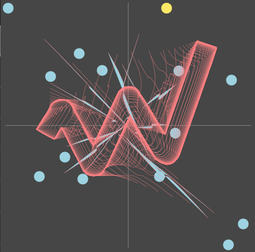
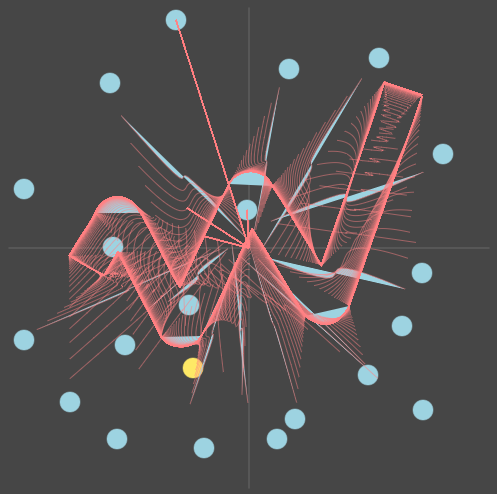
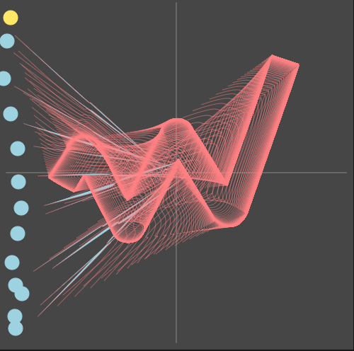

# Dotmate
An animation interface for stylistic and randomized logo animations.

&nbsp;
## Usage
1. Clone this repository.
2. Navigate to the cloned directory and run `npm install` in a terminal window
3. After installation completes, run `npm run dev-front`
4. Open localhost:5300 in a browser window

This app can be used to create a logo animation based on dots that the user draws.
The logo that gets drawn uses data from an array of bezier curve points defined in logo.js.

&nbsp;
## Examples

&nbsp;
## Make an animation
1: Add dots by clicking in the canvas.
2: Choose to use background or fill.
3: Set lerp speed and stroke weight.
4: Press 'Animate'.

&nbsp;
## Demo

